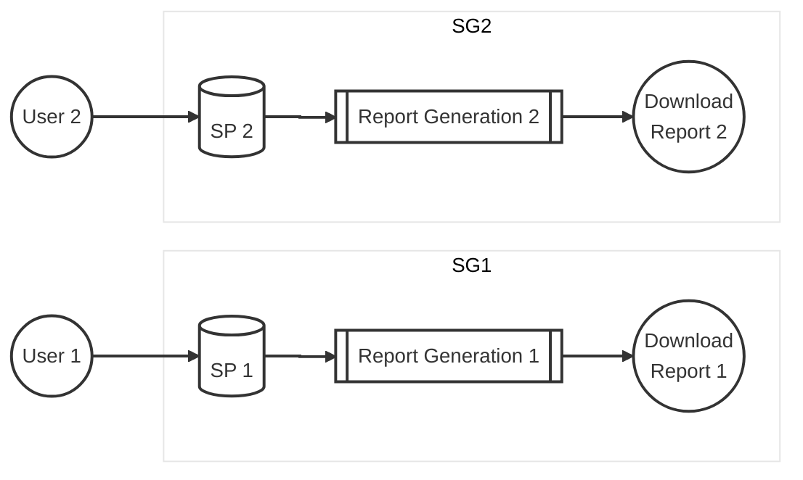

### Implementation of Asynchronous Report Generation with Distributed Locking
- **Status:** Accepted
- **Context:** The current report generation process involves executing complex Stored Procedures (SP) in MS SQL Server, followed by file generation using the Apache POI framework.

  - **Performance Bottleneck:** The SP execution takes ~2 minutes, and Excel generation takes ~3 minutes.
  - **Concurrency Issue:** MS SQL Server encounters lock contention when multiple users request the same report simultaneously. If locks are not released within the timeout period, transactions are rolled back, resulting in a poor user experience and failed requests.
  - **Resource Exhaustion:** Keeping a synchronous HTTP connection open for 5+ minutes is inefficient and prone to timeouts at the Load Balancer/Gateway level.
 

- **Decision:** We will decouple the report request from the generation process by implementing an Asynchronous Request-Response Pattern combined with a Time-Based Locking Mechanism at the application level.
  - **Non-Blocking API:** The client receives an immediate 202 Accepted response with a unique reportId or status polling URL.
  - **Java-Based Locking:** Before executing the SP, the application will attempt to acquire a lock (e.g., using a ReentrantLock or a distributed lock like Redis/Hazelcast if in a clustered environment).
  - **Timeout Logic:** If the lock cannot be acquired within a specific threshold, the system will return a "Report in progress" message rather than allowing a database-level contention/rollback.
  - **Decoupled Logic:** The Stored Procedure execution and the Apache POI Excel writing logic will be executed in a separate background thread (e.g., @Async or a dedicated ExecutorService).

- **Consequences:**
  - **Positive:**
    - **Database Stability:** Prevents MS SQL Server transaction rollbacks and reduces overhead on the database engine by limiting concurrent executions of heavy SPs.
    - **Improved UX:** Users are not stuck on a loading screen. They can continue working while the report generates in the background.
    - **Resilience:** System timeouts (HTTP 504) are eliminated since the initial request is short-lived.
  - **Negative/Neutral:**
    - **Increased Complexity:** Requires implementing a status polling mechanism or a WebSocket/Notification system to alert the user when the file is ready.
    - **State Management:** The application must now track the state of reports (e.g., PENDING, PROCESSING, COMPLETED, FAILED) in a metadata table or cache.
    - **Storage Requirements:** Generated files must be temporarily stored (e.g., S3, Azure Blob, or a shared file system) until the user triggers the final download.
