### Data Staging Area for Batch Processing
**Status:** Accepted

**Context:** We need a robust way to handle ETL (Extract, Transform, Load) processes for large datasets. Without staging, direct ingestion causes several problems: 
- **Performance Issues:** Complex transformations during extraction create high resource contention.
- **Low Reliability:** Failure during the extraction/transformation process means the entire batch must be rerun, creating bottlenecks.
- **Audit/Compliance:** Raw data is not stored, making it impossible to re-process data or trace data lineage in case of audit. 

**Alternatives Considered:**
- **Alternative 1:** Direct Load to Target (No Staging) - Lowers initial complexity but creates high risk of data inconsistency, slows down the production database, and makes re-processing difficult.
- **Alternative 2:** In-Memory Processing - Too constrained by memory limits when handling large batch files.
- **Alternative 3:** Dedicated External Staging Area (Accepted) - Provides a buffer between extraction and loading. 

**Decision:** We will adopt a dedicated staging area (using S3/Blob Storage/Temporary DB Schema) where data is stored in its raw format ("landing") before being transformed. 

**Implementation Details:**
- **Separation of Duties:** Staging is strictly used for staging; it is not accessible to end-users.
- **Raw Data Retention:** Raw files (CSV, JSON, Parquet) will be retained for a defined period (e.g., 7 days) to facilitate auditing and reprocessing.
- **Data Quality Checks:** Data validation (null checks, schema verification) will occur after the data lands in staging but before the final transformation.

```mermaid
%%{
  init: {
    'theme': 'base',
    'flowchart': { 'curve': 'stepBefore' },
    'themeVariables': {
      'primaryColor': '#ffffff',
      'primaryBorderColor': '#000000',
      'lineColor': '#000000',
      'fontFamily': 'arial',
      'fontSize': '14px',
      'fontWeight': 'bold'
    },
    'style': {
      'global': [
        '.node rect, .node circle, .node polygon, .node path { stroke-width: 3px !important; }',
        '.edgePath .path { stroke-width: 3px !important; }'
      ]
    }
  }
}%%
graph LR

  Source["Data Source"] -->|JSON/csv|StagingPVC[Persistance Volume
                                          Staging]
  StagingPVC --> Table[Conver to Table]
  Table --> StagingDB[(Database
                        Staging)]
  StagingDB --> Processing[Data Transformation
                            & Processing]
  Processing --> MainDB[(Database Main)]

    %% High-contrast styling
    classDef pink fill:#FFD3DA,stroke:#333,stroke-dasharray: 2 2,stroke-width:3px
    classDef skyblue fill:#D6F7FF,stroke:#333,stroke-dasharray: 2 2,stroke-width:3px
    classDef yellow fill:#fff9c4,stroke:#333,stroke-dasharray: 2 2,stroke-width:3px
    classDef node stroke:#333,stroke-width:2px

  
    linkStyle default stroke:#333,stroke-width:2px;

    class StagingDB,MainDB pink;
    
```

**Consequences:**
- **Positive:**
  - **Resilience & Auditing:** If the main processing job fails, the staging area holds the raw data, allowing for re-running the process without re-extracting from source systems.
  - **Performance:** Extraction from source systems happens in a quick "pull" operation, freeing up the data warehouse for queries.
  - **Decoupling:** Decouples the extractors from the transformers, allowing them to scale independently. 

- **Negative:**
  - **Initial Complexity:** Adds an extra step to the ETL/ELT pipeline.
  - **Storage Costs:** Requires additional storage capacity for the staging area.
  - **Data Latency:** Introducing an intermediary step adds latency to the overall data availability. 
