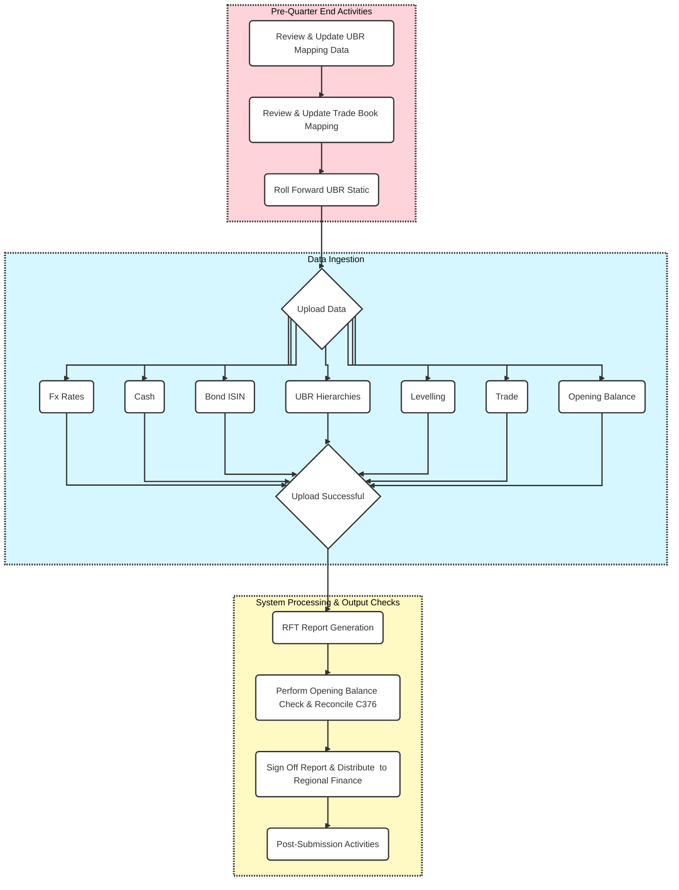

# Hercules

## Table of Contents

- [Introduction](#introduction)
- [Flow Diagram](#flow-diagram)
- [Project Purpose](#%EF%B8%8F-project-purpose)
- [The Legacy Challenge (The Monolith)](#-the-legacy-challenge-the-monolith)
- [The Modern Solution (Hercules Architecture)](#-the-modern-solution-hercules-architecture)
- [Architecture](#%EF%B8%8F-architecture)
- [Technology Stack](#-technology-stack)
- [Phase Wise Evolution (Strangler Fig Pattern)](#phase-wise-evolution-strangler-fig-pattern)
- [Project Structure](#project-structure)
  
---

### Introduction
Deutsche Bank has many financial assets and liabilities like stocks, bonds and loans. Regulators want to know the bank values these items, especially those that are not easily priced in the market (called "Level 3" valuation).

The **Hercules** system is designed and developed to gather all the necessary financial information, proceess it and create 3 specific IFRS 13 reports (Forms C337, C376, C377)

- **IFRS 13:** Mandates the disclosure of financial instrument classification at fair value into a three level hierarchy (Level 1, Level 2 and Level 3).
- **Form C337:** Discloses the Fair Value of Deutsche Bank's Financial Instruments valued using a Level 3 valuation (significant unobservable inputs).
- **Form C376:** Requires a Roll Forward Table for Level 3 Financial Assets and Liabilities, explaining movements ue to fair value changes, cash movements, and transfers between levels.
- **Form C377:** Discloses unrealized P&L on Level 3 financial instruments held at the reporting date.

---

### Flow Diagram

Below is the flow diagram depicting typical actvities performed by Users to submit IFRS reporting to the Finances.


---

### 🏗️ Project Purpose
**Hercules** is a reference architecture designed to modernize a legacy financial reporting monolith. The project demonstrates how to transition from high-risk, manual workflows to a scalable, automated, and secure microservices ecosystem.

---

### 🔴 The Legacy Challenge (The Monolith)
The existing system is a single-tier, thick client, standalone reporting application that has reached its "Technology Obsolescence" phase. It creates significant bottlenecks in the bank’s digitization roadmap:
- **Operational Risk:** Reliance on manual Excel-driven workflows and email-based data sharing leads to high margin of error and data fragmentation.
- **Security Debt:** Lacks standard OAuth2/OIDC protocols; sensitive credentials and user data are stored in insecure, local databases.
- **Scalability Bottlenecks:** A single-threaded execution model prevents concurrent data ingestion, causing significant "Slow Execution" during month-end reporting spikes.
- **Audit & Compliance Gaps:** No centralized data lineage or end-to-end audit trail, making regulatory compliance difficult to verify.

---

### 🟢 The Modern Solution (Hercules Architecture)
To eliminate technical debt and accelerate deployment cycles, **Hercules** introduces a containerized Java/Spring Boot architecture deployed on OpenShift:
- **Scalable Microservices:** Replaces the single-threaded monolith with a modular design, allowing independent scaling of high-load data ingestion tasks.
- **Automated Data Lifecycle:** Implements an Automated Scheduler for ingestion, removing "IT Intervention" and empowering business users to run on-demand reports via a modern React UI.
- **Observability & Monitoring:** A real-time Monitoring Dashboard provides instant visibility into pipeline health, reducing the "Mean Time to Recovery" (MTTR) for failed tasks.
- **Enterprise Security & Audit:** Integrated Audit Trails capture every system and user action, ensuring 100% traceability from source to target—critical for banking regulations.
- **CI/CD Ready:** Optimized for rapid deployment cycles using Kubernetes-native patterns, reducing deployment time from days to minutes.

---

### 🏛️ Architecture
-  [High Level Design](architecture/HLD.md)
-  [Low Level Design](architecture/LLD.md)
-  [Entity-Relationship Diagram](data-models/ERD.md)
-  [ADRs](ADRs/001-deadlock-prevention.md)
---

### 🚀 Technology Stack

- **Backend:** Java 17+, Spring Boot 3, Spring Batch 5, REST APIs
- **Database:** Oracle 19c / MS SQL Server
- **Frontend:** ReactJS (Hooks/Redux)
- **Containerization:** Docker
- **Orchestration:** Kubernetes (K8s) / OpenShift
- **Testing:** JUnit 5, Mockito
- **Build/Scripting:** Groovy (Gradle)

---

### Phase-wise Evolution (Strangler Fig Pattern)

- **Phase 1:** Build new Spring Boot backend READ APIs for React front end and future integrations.
- **Phase 2:** Build new React UI (reporting / dashboards) and run both systems in parallel.
- **Phase 3:** Feature-by-Feature Strangulation - for each module, build spring boot API, react UI, deploy on Openshift using Helm.
- **Phase 4:** Excel ingestion → Spring Batch. Run both system in paralled and validate outputs and then swich to Openshift Jobs.
- **Phase 5:** Authentication centralization - Move to OAuth 2.0 base authentication and authorization framework.
- **Phase 6:** Disable DB access from thick client.
- **Phase 7:** Full user migration.
- **Phase 8:** Decommission.

---

### Project Structure

```
├── src/
│   ├── main/java/                        # Application source code
|   |   └── .../controller                # Handles incoming HTTP requests and outgoing responses, defining the API endpoints.
|   |   ├── .../service                   # Encapsulates the core business logic and rules of the application.
|   |   ├── .../repository                # Manages data persistence and retrieval.
|   |   ├── .../entity                    # Defines the JPA data models or entities used in the application mapping to database tables.
|   |   ├── .../dto                       # Contains Data Transfer Objects, used to decouple the API representation from the internal data models.
|   |   ├── .../config                    # Stores configuration-related classes (e.g., security, database settings).
│   ├── main/resources/                   # Application resources
│   ├── test/java/                        # Test source code
│   └── test/resources/                   # Test resources
├── Dockerfile                            # Defines how to build the application container image
├── Jenkinsfile                           # Defines the CI/CD pipeline
├── charts/                               # Directory to hold the Helm chart(s) for the application
│   └── <module-chart-name>/              # The specific chart directory (e.g., fx-rate)
│       ├── Chart.yaml                    # Helm Chart metadata (name, version, etc.)
│       ├── values.yaml                   # Default configuration values for the chart
│       ├── templates/                    # Kubernetes resource templates (Deployment, Service, etc.)
│       │   ├── deployment.yaml           # Defines the Kubernetes Deployment
│       │   ├── service.yaml              # Defines the Kubernetes Service
│       │   ├── route.yaml                # OpenShift Route
│       │   └── ...
│       └── ...
├── docs/                                 # Documentation
├── scripts/                              # Utility scripts
├── pom.xml                               # Maven configuration
└── README.md                             # Readme file

```
---
