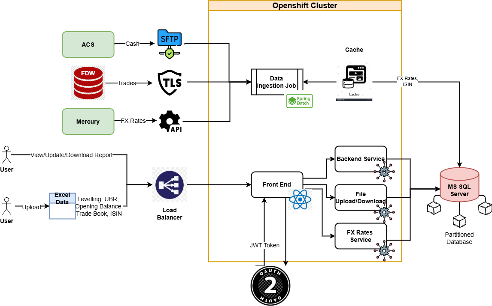

### Hercules - High Level Design (HLD)

The HLD is divided into two major parts: **Data Ingestion Job** and **Microservices for Report Generation**.
- **Data Ingestion Jobs**:
  - **Cash data** is in csv format pushed to SFTP location along with control file containing file hash code to perform data integrity check. Data Ingestion job pulls these files connecting to SFTP location, process them and store them to database.
  - FDW system holds **Trade data** in their Oracle database system and exposed read-only database schema for the consumer to fetch data using SQL queries via TLS. Hercules connects to FDW database through TCPS connection and queries relevent trade tables.
  - Mercury is Deutsche Bank standard source system for global **FX rates** and it exposes it's service via KDB API.
  - In-memory cache has been used to pre-load the FX rates and other reference data for Trade and Cash data processing job to improve the performance.
 
- **Microservcies or Report Generation**:
  - 
